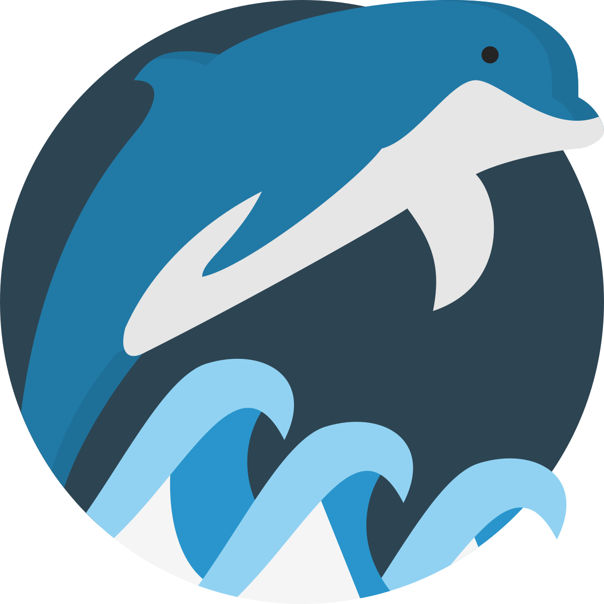

#  __Welcome to WireDolphin !__  

## __Lancement__
Afin de lancer WireDolphin il suffit d'executer la commande suivante à la racine de notre dossier :
  ```
./script.sh 
  ```

> **⚠ WARNING: Supported OS for dependancies installation.**  
> MACOS , Linux . (Sorry for Windows users)

## __Accès__ 
Pour y acceder ouvrez votre navigateur favoris et allez à l'adresse :
- [Dive into WireDolphin](http://localhost:3000/)

Vous pouvez maintenant naviguer dans votre Analyseur de Paquet favoris!