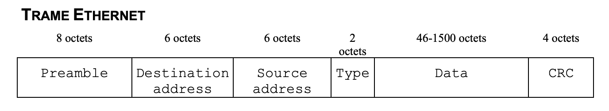
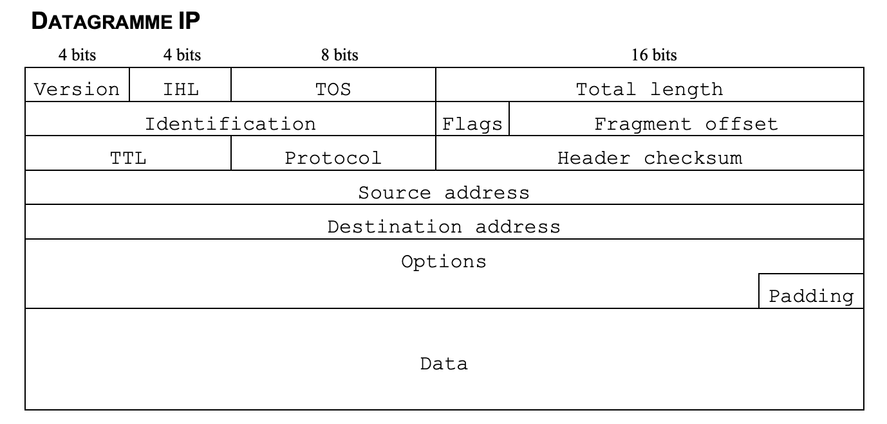
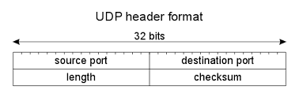
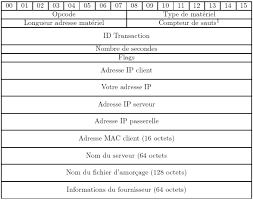
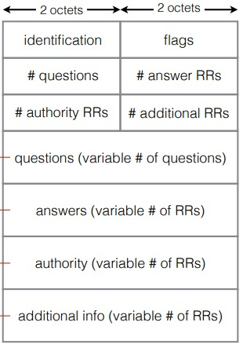

#  __Want to understand WireDolphin ?__  

## __Primary Authors__


* __[Roman Randrianarisoa - 3808834](https://github.com/romanrndrnrs)__

    @romanrndrnrs co-founder of WireDolphin and one of the top contributor.

* __[Cyrena Ramdani - 3805942](https://github.com/Cyren4)__

    @Cyren4 co-founder of WireDolphin and one of the top contributor

-------------
## __Projet_WireShark__

### Précisions :
- Ce projet a été fait dans le cadre de l'enseignement  `LU3IN033` au sein de Sorbonne Université
- Ce ReadMe expliquement le cheminement de notre projet et de son implémentation
- Cet analyseurs de paquet s'est beaucoup inspiré de __[WireShark](https://www.wireshark.org/)__ 
- Toutes les traces analysées avec succès sont dans le dossier [ouput](sources/output) avec pour nom : output_Y-m-d_H.M.S.txt

### Plan :
#### I - Faire un analyseur de paquet
- Le sujet
- Appréhender le projet
#### II - Parsing et Vérification
#### III - L'analyse de Paquet
1. Trame 
2. Ethernet - Couche 2
3. IP - Couche 2
4. UDP - Couche 4  
5. DHCP & DNS - Couche 7
6. Exemples de tests
#### IV - Application (« Interface Graphique »)
1. Envoi du fichier au serveur
2. Accès au fichier .Json retourné par le serveur
3. Affichage grâce à JavaScript/Html/css
#### V - Automatisation
1. Script d'installation des dépendances
1. Vidéo de présentation
#### VI - Output et gestion d'erreur
#### VII - Copyright<br><br>


#  I - Faire un analyseur de paquet?
### __Le sujet__
L’objectif de ce projet est d’écrire un analyseur de protocoles réseau ‘offline’.


### __Appréhender le projet__
Nous avons essayé de voir le comportement de WireShark avec divers trames et analysé son comportement. Nous avons aussi relu les slides de cours ainsi que cet [article sur le fonctionnement d'internet](https://spathis.medium.com/comprendre-internet-et-son-fonctionnement-9b2f63a07430)

# II - Parsing et Vérification
### __Parsing__
La fonction [get_clean_trame(file)](sources/web/Node-app/pythonScript/parse_trame.py) récupère un fichier contenant les offsets ainsi que les trames à analyser et retourne un booléen ```(error, trame)```. 
- Si __error__ = True,  __trame__ contient le message d'erreur et le main raise une exception qui va faire afficher une fenetre Popup 
- Sinon __trame__ contient la trame en forme de string qui sera analysé par la suite

Afin d'analyser notre Trame nous avions besoin de récuperer les données nécessaires en supprimant les éléments indésirables comme:
- les chaines de caractères en fin de ligne
- offset invalide (dans ce cas nous avons décidé de considerer la trame invalide car il est tres probable que le reste soit corompu ou incomplète) 

### __Vérification__
Si une des contraintes a ete rencontré 2 cas de figures s'offrent à nous : 
- __Ignorer l'erreur__ : champs analysé incorrecte (options impossible ou champs pas pris en charge) 
- __Arreter notre analyse__ : dans le cas d'un mauvais offset


# III - L'analyse de Paquet
## 1. __Trame & Ethernet__ - Couche 2 <br>
Plusieurs trames peuvent etre contenu dans un fichier. [get_clean_trame(file)](sources/web/Node-app/pythonScript/parse_trame.py)  renverra ainsi une trame par ligne. Afin de naviguer entre celles-ci nous avons jugé nécessaire de les numéroter à l'aide de `Trame.id`. La classe [Trame]((sources/web/Node-app/pythonScript/Trame.py)) récupèrera l'entete avec les champs Ethernet : Adresse MAC Destination et Source, le type de protocole ainsi que le reste de la trame qui sera mis dans `Trame.paquet`. Tous les protocoles sont stockés dans le dictionnaire __`ETHTYPE`__ (issue de [normeETH](sources/normes/ethtype.txt)) mais seul le protocole IPV4 est pris en charge dans la version Beta.

 

## 2. __IP__ - Couche 2

Seul protocole UDP est pris en charge dans la version Beta et sera mis dans `Paquet.data` et analysé dans la classe Datagramme.<br>
La classe [Paquet](sources/web/Node-app/pythonScript/Paquet.py) récupèrera l'entete IP qui se présente sous cette forme: 
#  

## 3. __UDP__ - Couche 4  

Le ``User Datagram Protocol`` est un des principaux protocoles de télécommunication utilisés par Internet. Dans notre application seul protocole UDP est pris en charge dans la version Beta et sera mis dans `Paquet.data` et analysé dans la classe ``Datagramme``.<br>
La classe [Datagramme](sources/web/Node-app/pythonScript/Datagramme.py) récupère l'entete UDP qui se présente sous cette forme : 
#  

## 4. __DHCP & DNS__ - Couche 7

### __DHCP__
Toutes les types de messages DHCP sont stockés dans le dictionnaire __`DHCPTYPE`__ (issue de [normeDHCPopt](sources/normes/dhcp_options.csv)) mais seul les 8 messages principaux sont pris en charge (Discover, Offer, Request, Decline, ACK, NAK, Release, Inform) avec les options associés qui sont stockés dans le dictionnaire __`DHCPOPTION`__ (issue de [normeDHCPopt](sources/normes/dhcp_options.csv)). Elles sont toutes récupérées et analysées avec succès.
> **⚠ WARNING: Suite à une erreur de syntaxe Json nous n'affichons pas correctement les options sur notre site.** 
> Pour avoir notre analyse complète nous vous invitons à regarder l'output associé dans le dossier [output](sources/output)<br>


La classe [DHCP](sources/web/Node-app/pythonScript/DHCP.py) récupèrera le message DHCP qui se présente sous cette forme : 
# 


### __DNS__

Chaque élément du message DNS est stocké dans une variable. Il y a des boucles afin de créer des variables dans un tableau en fonction du nombre de questions et de réponses par exemple. Afin d’utiliser la compression DNS nous avons mis en place un système de pointeur qui permet de naviguer simplement à l’endroit pointé. Les datas sont converties selon qu’elles soient une adresse ou un name.
La classe [DNS](sources/web/Node-app/pythonScript/DNS.py) récupèrera le message DHCP qui se présente sous cette forme : 
# 

## 5. __Exemples de tests__
Plusieurs trames de tests sont à votre disposition dans le dossier [trames](trames)

# IV - __Application__ (« Interface Graphique »)
## 1. __Envoi du fichier au serveur__<br>
Après avoir sélectionné le fichier que vous souhaitez analyser, celui-ci est envoyé au serveur grâce à une requête POST. Le serveur se charge ensuite de télécharger de son côté ce fichier grâce à express-fileupload notamment. Le serveur peut donc facilement accéder au fichier que vous venez d'envoyer. Il se charge ensuite d'éxecuter le script python d'analyse qui retournera les résultats de l'analyse ou un message d'erreur s'il y'en a au format .Json<br><br>

## 2. __Accès au fichier__ .Json retourné par le serveur <br>
Ce fichier .Json est mis à disposition à l'url ```"url-d'origine"/fichier```. Ainsi côté client : l'application peux y accéder simplement grâce à fetch API en y indiquant l'url contenant les données .Json. Ces données sont ensuite enregistrées côté client dans une variable "data" qui est au format json et exploité par l'application.<br><br>

## 3. __Affichage__ grâce à JavaScript/Html/css<br>
Comme "data" est une variable présente côté client, il est désormais possible de jouer avec et de permettre différents affichages en fonction des évènements se déroulant sur l'application web. Les outils utilisés  sont les outils classique de développement web : HTML/CSS/JavaScript


# V - Automatisation
### __Script__ d'installation des dépendances
Disponible dans le fichier [script.sh](script.sh) si les droits ne sont pas disponibles pour l'execution avec __```./script.sh```__ il y a 2 solutions:
- Donner les droits nécessaires en executant :
```
chmod 755 script
```

- Executer avec  __```bash script.sh```__ ce qui ne nécessite pas des droit d'utilisateur particulier.

Pour des explications plus claires lisez : [Mode d'utilisation](howto.md)

### Script d'installation des dépendances
N'oubliez pas de voir notre vidéo de présentation : [3805942_Ramdani_Cyrena  3808834_Roman_Randrianarisoa - Gr6](https://youtu.be/8TW2tnwzCtQ)

# VI - Output et gestion d'erreur
Comme expliqué plus haut toutes les analyses de trames sont disponibles dans [ouput](sources/output) avec pour nom : output_Y-m-d_H.M.S.txt <br> 

# VII - Copyright 
- Inspiration pour l'application :  __[WireShark](https://www.wireshark.org/)__  
- [Vidéo d'introduction](https://www.youtube.com/watch?v=xIatspadXcc&ab_channel=ImaginationInstitute) issu du film : [Le Guide du voyageur galactique](https://fr.wikipedia.org/wiki/Le_Guide_du_voyageur_galactique)


> **⚠ WARNING: Pour une documentation plus précise se réferer à notre Github.** 